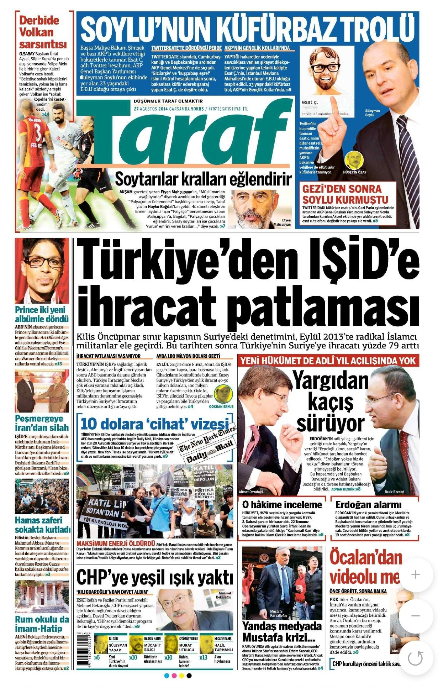

# Case 00 — Cross-Border Trade Risk (Turkey–Syria, 2013–2014)

> This case is based on real open-source reporting and reflects a non-hypothetical trade pattern observed during the Syrian conflict.
*Figure: Reported trade activity increase following border control shift (2013)*

## Case Summary

This case examines a documented increase in Turkey’s exports to Syria following a significant shift in territorial control along the border during the Syrian conflict.

According to open-source reporting, control of the Kilis–Öncüpınar border crossing on the Syrian side shifted to ISIS (Islamic State) in September 2013. Following this development, Turkey’s exports to Syria reportedly increased by approximately 79%.

This pattern is notable because trade volumes increased despite:
- escalating conflict conditions
- loss of formal state control over parts of the border
- presence of a designated terrorist organisation in the trade corridor

From an AML/CFT perspective, this creates a high-risk environment where legitimate trade, informal trade, and illicit financial flows may overlap.

---

## Context

- **Countries involved:** Turkey → Syria  
- **Key location:** Kilis – Öncüpınar border crossing  
- **Timeframe:** 2013–2014  
- **Event trigger:** Territorial control shift to ISIS  

The reported data suggests:
- Monthly trade volume ~100 million USD  
- Daily movement estimated at 40–50 million USD  

---

## Why This Case Matters

Under normal conditions, conflict escalation and loss of border control would be expected to reduce trade activity.

However, in this case:
- Trade continued  
- Trade increased significantly  

This divergence between expected and observed behaviour is a key analytical signal.

Such patterns are commonly associated with:
- Trade-Based Money Laundering (TBML)
- Sanctions evasion
- Use of intermediaries or informal trade channels
- Reduced transparency in counterparty identification

---

## Source Note

This case is based on contemporaneous newspaper reporting and open-source material documenting trade patterns during the Syrian conflict period.

The purpose of this analysis is not to validate the political claims of the source, but to interpret the reported trade behaviour through a financial crime risk lens.
