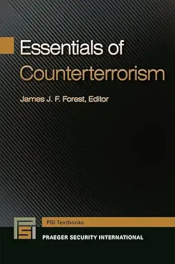

# Case 00 — Cross-Border Trade Risk (High-Risk Jurisdiction Exposure)

This case is based on original investigative reporting later cited in academic counterterrorism literature.

---

## 1. Background

Following the weakening of state control at the Kilis–Öncüpınar border in 2013, cross-border trade activity between Turkey and Syria increased significantly.

The region became partially controlled by non-state actors, creating an environment with limited regulatory oversight and increased financial crime risk.

---

## 2. Key Findings

- Rapid increase in export volume to a conflict-affected region  
- Trade routes overlapping with areas under non-state control  
- Limited transparency in counterparties and end-users  
- Inconsistencies between official data and observed activity  

---

## 3. Risk Indicators

- High-risk geography (conflict zone)  
- Weak regulatory and customs enforcement  
- Use of intermediaries  
- Lack of verifiable beneficial ownership  
- Abnormal trade patterns  

---

## 4. Network Structure

The observed activity suggests a multi-layered structure:

- Exporters operating in regulated jurisdictions  
- Intermediary entities facilitating trade and logistics  
- End-points located in high-risk or uncontrolled regions  

Such structures are commonly used to obscure ownership and bypass controls.

---

## 5. Financial Flow Analysis

- Goods exported through formal channels  
- Value potentially transferred via indirect or layered transactions  
- Difficulty identifying final beneficiaries  
- Blending of legitimate and illicit trade flows  

This pattern is consistent with trade-based money laundering typologies.

---

## 6. Risk Assessment

Risk Level: HIGH

Exposure includes:

- Trade-Based Money Laundering (TBML)  
- Indirect sanctions exposure  
- Shadow economy participation  
- Counterparty opacity  

---

## 7. AML Implications

- Enhanced Due Diligence (EDD) required  
- Beneficial ownership verification challenges  
- Increased transaction monitoring sensitivity  
- Geographic risk flagging  
- Adverse media relevance  

---

## 8. Hypothetical Client Scenario

A client engaged in cross-border trade within this region would present:

- Elevated geographic risk  
- Limited transparency in counterparties  
- Potential indirect exposure to sanctioned or high-risk entities  

---

## 9. Decision

Recommended Action: ESCALATE

Rationale:  
The combination of geographic exposure, abnormal trade patterns, and limited transparency requires enhanced due diligence and further investigation prior to onboarding or transaction approval.

---

## 10. Evidence & Sources

### Investigative Reporting (2014)

---

### Academic Reference (2015)

Referenced in *Essentials of Counterterrorism* (Praeger Security International, 2015), examining trade networks and shadow economy dynamics in conflict regions.
