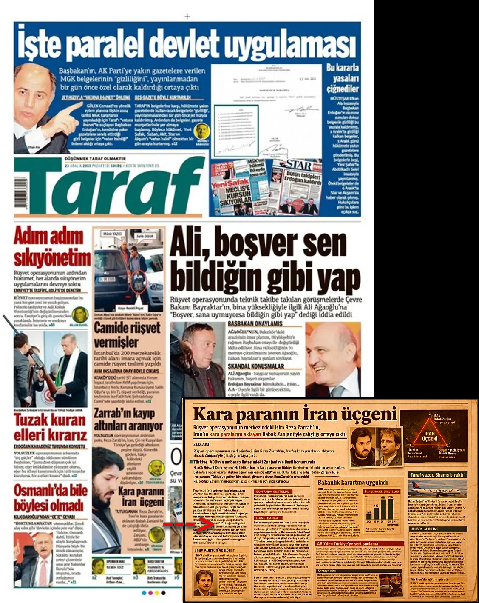

# Case 01 — Iran Sanctions Evasion Network

## Overview
This case analyzes a cross-border network involving Iranian, Turkish, and UAE-linked entities from an AML/CFT and sanctions risk perspective.

---

## Key Focus Areas

- Sanctions evasion  
- Network-based money laundering  
- Trade-based money laundering (TBML)  
- Cross-border financial flows  

---

## Why This Case Matters

This case demonstrates how early-stage OSINT analysis can reveal structural risk signals in complex cross-border networks.

It highlights:
- identification of hidden relationships  
- analysis of layered ownership structures  
- detection of sanctions-related risk exposure  

---

## Key Insight

The structural patterns identified in this case are consistent with typologies commonly associated with sanctions evasion and cross-border financial crime.

---

## Source Note

This case is based on contemporaneous reporting authored by the analyst.

*Original reporting by the analyst (2013)*

The same material is re-examined here through an AML/CFT lens, focusing on risk indicators, network structure, and potential sanctions exposure.

---

## Files

- `02-analysis.md` → full AML analysis  
- `03-network.md` → network structure  
- `04-timeline.md` → development and exposure timeline  

This case examines a cross-border network potentially used for sanctions evasion and money laundering involving Iranian, Turkish, and UAE-linked entities.

The analysis is based on open-source intelligence (OSINT), including early investigative findings prior to major international exposure.

---

## Background

During the period of international sanctions on Iran, multiple financial and commercial structures were developed to bypass restrictions and move funds across jurisdictions.

This case focuses on early indicators of such a structure involving aviation assets and intermediary actors.

---

## Key Entities

- **Babak Zanjani** — Iranian businessman, later sanctioned by US and EU authorities  
- **Reza Zarrab** — Financial intermediary involved in cross-border transactions  
- **Mahdi Shams** — Business intermediary linking entities  
- **Onur Air** — Turkey-based aviation company  
- **Qeshm Air** — Iran-linked airline  

---

## Core Event

A Turkey-based aviation company’s aircraft were transferred or operated under an Iran-linked airline associated with a sanctioned individual.

This raised concerns regarding:
- Sanctions evasion
- Asset-based transaction structures
- Indirect exposure to blacklisted entities

---

## Geographic Scope

- Turkey  
- Iran  
- United Arab Emirates  
- Additional jurisdictions linked to financial flows  

---

## Initial Risk Indicators

- Links to sanctioned individuals  
- Use of intermediaries in ownership/operations  
- Cross-border asset transfers  
- Complex corporate relationships  

---

## Objective

To analyze the structure and identify potential financial crime risks using OSINT-based methodology.
